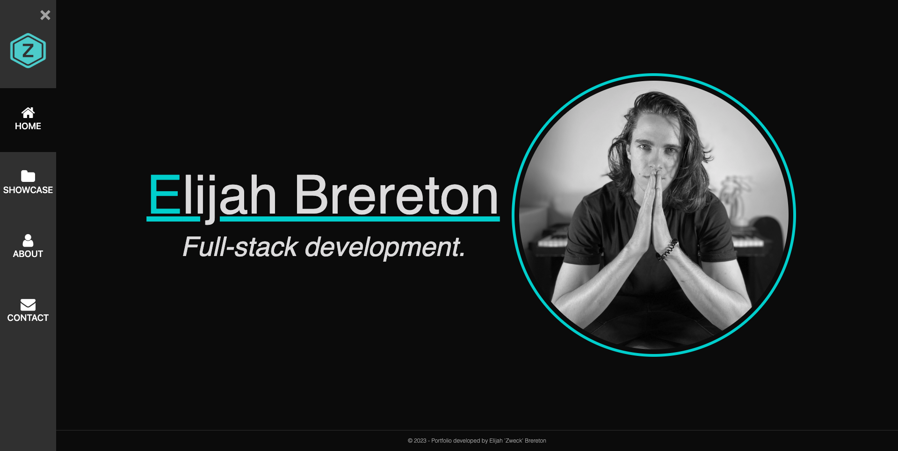
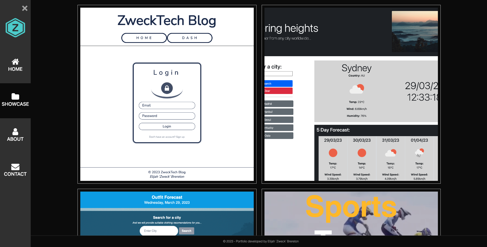
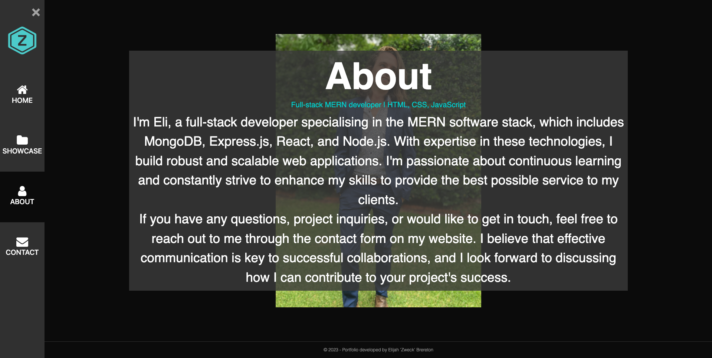
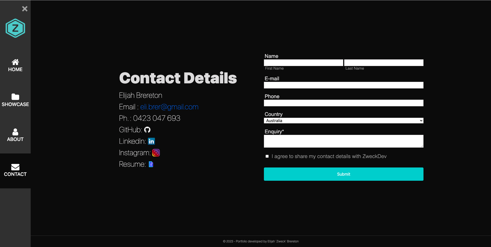

## Elijah 'Zweck' Brereton's Portfolio


*Elijah 'Zweck' Brereton's portfolio page to showcase work completed, read a short bio, or find information to contact Elijah*

[](https://developer.mozilla.org/en-US/docs/Web/JavaScript)  [](https://developer.mozilla.org/en-US/docs/Web/CSS) [](https://developer.mozilla.org/en-US/docs/Web/HTML)

---

## Packages used
[](https://react.dev/) [](https://nodejs.org/en/) [](https://www.npmjs.com/package/gh-pages/) 

---

## Links
GitHub Repository: [@elibrer](https://github.com/elibrer/elijah-zweck-brereton-portfolio)

Link to deployed application: [@Elijah 'Zweck' Brereton Portfolio](https://elijah-brereton-portfolio-6d2dfbb4a03e.herokuapp.com/)

---

## Contributors
> Elijah Brereton @[GitHub](https://github.com/elibrer)

---

## Table of Contents
- [Description](#description)
- [Installation](#installation)
- [Features](#features)
- [Documentation](#documentation)
- [Application Preview](#application-preview)
- [License](#license)
- [Tests](#tests)
- [Questions](#questions)

---

## Description
This repository contains the code for my portfolio website, which serves as a showcase of my projects and reflects my ongoing development journey. Through this website, I aim to demonstrate the skills and knowledge I have acquired in web development, particularly utilising the MERN stack (MongoDB, Express.js, React.js, Node.js)

I have built this portfolio as a platform to continuously update and improve as I progress in my career. It represents my dedication to honing my programming abilities and serves as a testament to my passion for web development.

By continually refining and expanding this website, I strive to create a valuable resource to exhibit my work to potential clients and employers. It not only displays the projects I have completed but also showcases the growth and expertise I have gained through research, learning, and practical application.

---

## Installation

For usage of this application, visit the [Portfolio](https://elibrer.github.io/elijah-zweck-brereton-portfolio/#/) website via heroku. No further installation is required to access and operate the web page. 


---

## Features
```md
- GIVEN a single-page application portfolio for Elijah Brereton
- WHEN I load the portfolio
- THEN I am presented with a page containing a nav bar, a section for content, and a footer
- WHEN I view the nav bar
- THEN I am presented with navigation with titles corresponding to different sections of the portfolio
- WHEN I view the navigation titles
- THEN I am presented with the titles Home, Showcase, About, and Contact, and the title corresponding to the current section is highlighted
- WHEN I click on a navigation title
- THEN I am presented with the corresponding section to the side of or below the navigation without the page reloading and that title is highlighted
- WHEN I load the portfolio the first time
- THEN the Home landing page is selected by default
- WHEN I am presented with the About section
- THEN I see a recent photo or avatar of Elijah Brereton and a short bio about them
- WHEN I am presented with the Showcase section
- THEN I see titled images of six of Elijah Brereton’s applications with links to both the deployed applications and the corresponding GitHub repositories
- WHEN I am presented with the Contact section
- THEN I see a contact form with fields for a first name, last name, an email address, a phone number, a country input, and an enquiry message - with the option to share all or none of the contact info
- WHEN I move my cursor out of one of the form fields without entering text, or press submit without the required fields having content
- THEN I receive a notification that this field is required, or to fill out all required fields
- WHEN I enter text into the email address field
- THEN I receive a notification if I have entered an invalid email address
- WHEN I enter text into the phone number field
- THEN I receive a notification if I have entered an invalid Australian phone number 
- WHEN I wish to view Elijah's resume
- THEN I can access the link to the resume on the Contact page
- WHEN I wish to view Elijah's other social accounts, GitHub, LinkedIn, Instagram
- THEN I can access the link to those pages on the Contact page
- WHEN I view the footer
- THEN I am presented with a copyright logo, and a description of the porfolios creator
```

---

## Documentation
No documentation provided.

---

## Application Preview
### `Portfolio Landing Page`

### `Portfolio Showcase Page`

### `Portfolio About Page`

### `Portfolio Contact Page`


---

## License
[Licensed under the MIT license.](https://opensource.org/licenses/MIT)

---

## Tests
To test, simply run the application by using the instructions provided above. If there are any errors, or the application did not work in the intended way, please try to locate and log the lines of code that bring up the error, and forward all issues to the email below.

---

## Questions
For questions and enquiries, please contact me at: 
[eli.brer@gmail.com](eli.brer@gmail.com)